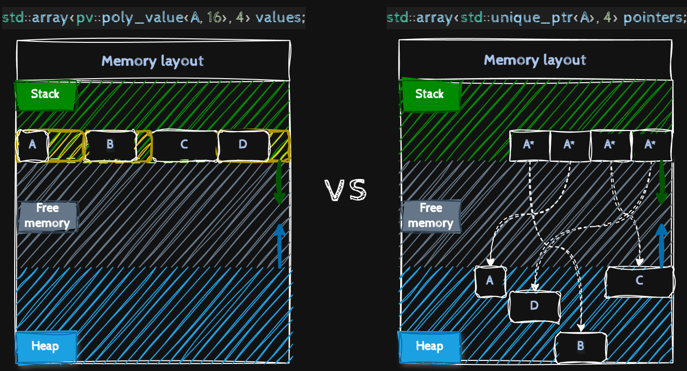

# poly_value <!-- omit from toc -->

Polymorphic C++ Classes on the Stack

- [Preview](#preview)
- [Problem](#problem)
- [A solution option](#a-solution-option)
  - [std::variant](#stdvariant)
    - [Pros](#pros)
    - [Cons](#cons)
- [Solution](#solution)
- [API](#api)
  - [Definition](#definition)
  - [Copy/Move](#copymove)


## Preview

```c++
class A {...};
class B: public A {...};
class C: public A {...};
class D: public A {...};

std::array<pv::poly_value<A, 16>, 4> values;
// No heap memory allocation
values[0].emplace<A>(...);
values[1].emplace<B>(...);
values[2].emplace<C>(...);
values[3].emplace<D>(...);

std::array<std::unique_ptr<A>> values;
// Heap memory allocations
values[0] = std::make_unique<A>(...);
values[1] = std::make_unique<B>(...);
values[2] = std::make_unique<C>(...);
values[3] = std::make_unique<D>(...);

```



## Problem

You have small polymorphic classes and you want to store them in a container, but since they can be of different lengths, you are forced to store them as pointers. This leads to greater data indirection and, as a consequence, worse performance due to cache misses.

## A solution option

### std::variant

#### Pros

- A variant object can store different classes
- No heap allocation

#### Cons

- To access a class method, you need to write a visitor for each class.
- In order for a variant to store a class, it must be declared as a parameter of the variant template

## Solution

Create a suitable storage for objects inherited from the base class, knowing the base class, you can call its methods from the created object.

## API

### Definition

To create a `poly_value` you must know:

- base class
- estimated storage size for the base class descendants

```c++
class Base {...};

using poly_value = pv::poly_value<Base, 32>;

class Derived: public {...};

poly_value value;
value = Derived();
```

At the time of defining a poly_value you do not need to know about the descendants of the base class.

### Copy/Move

Since values ​​are stored on the stack, we may want to assign one value to another.

```c++
class Base {...};

class Derived: public {...};

using poly_value = pv::poly_value<Base, 32>;

poly_value v1(Base{});
poly_value v2(Derived{});

v1 = v2; // At this point, v1 will call the Base destructor, then the Derived copy constructor.

v2 = std::move(v1); // At this point, v2 will call the Derived destructor, then the Derived move constructor.
```

For all this to work, it is necessary for classes to implement:

- a copy constructor

or

- copy assignment operator and a default constructor

In the case of move semantics, it is necessary for classes to implement:

- a move constructor

or

- move assignment operator and a default constructor.

You can control the presence of a copy or move operator using additional flags.

```c++
    pv::poly_value<Base, 16, pv::flags::Copyable> value;
    pv::poly_value<Base, 16, pv::flags::Moveable> value;
    pv::poly_value<Base, 16, pv::flags::Copyable | pv::flags::Moveable> value;
```
